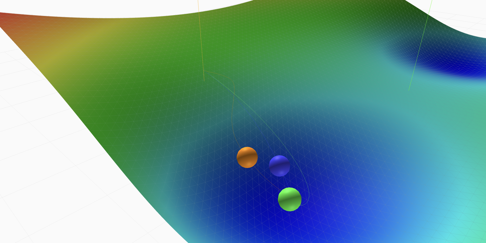

# Gradient Descent Experiments

Interactive 3D visualization of gradient descent optimization algorithms with various loss landscapes.

## Architecture

- **Frontend**: Static HTML/CSS/JS hosted on Vercel
- **Backend**: Flask API on Google Cloud Run (scales to zero)
- **Cost**: ~$0-2/month with light usage

## Quick Start

### Prerequisites

- Python 3.11+
- Node.js 18+ (for npm scripts)
- gcloud CLI (authenticated as patrickbrownai@gmail.com)
- Vercel CLI

### Local Development
