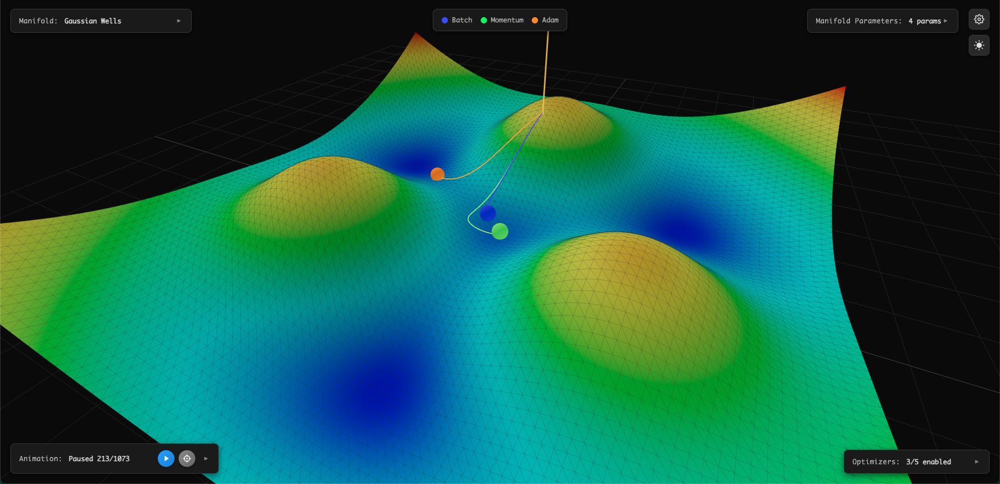

# GD Visualizer


A 3D visualization tool for understanding how different optimizers navigate loss landscapes. Watch multiple optimizers race down the same terrain and see why they end up in different places.



## What It Does

Renders parametrizable 3D loss landscapes and simulates gradient descent optimizers in real-time. Instead of running on actual ML models, this lets you test optimizer behavior on controlled topologies where you can see the entire terrain.

## Optimizers

- **Batch Gradient Descent**: Vanilla GD, stable but slow
- **Stochastic Gradient Descent (SGD)**: Faster convergence with mini-batch updates
- **Momentum GD**: Builds velocity to escape shallow local minima
- **Adam**: Adaptive learning rates per parameter
- **Wheel (experimental)**: Physics-inspired rolling wheel with gyroscopic stability

## Loss Landscapes

### Gaussian Wells
Adjustable depth, width, and number of local minima


### Ackley Function
Highly corrugated surface with deep central minimum


## Local Development

### Prerequisites

- Python 3.11+
- Node.js 18+
- Docker (optional)

### Start the App

**With Docker:**

```bash
docker-compose up
```

Frontend: `http://localhost:3000`  
Backend: `http://localhost:5001`

**Without Docker:**

Backend:
```bash
cd backend
pip install -r requirements.txt
python app.py
```

Frontend:
```bash
cd frontend
npm install
npm run dev
```

## Usage

1. Select a loss landscape (Gaussian Wells or Ackley)
2. Adjust landscape parameters to change the topology
3. Choose starting position
4. Select optimizers to compare
5. Tune hyperparameters (learning rate, momentum, etc.)
6. Run and watch them navigate the terrain

## Links

- [Live Demo](https://gd-visualizer.vercel.app)
- [Dev Blog](https://bicrick.com/projects/gd-visualizer)
